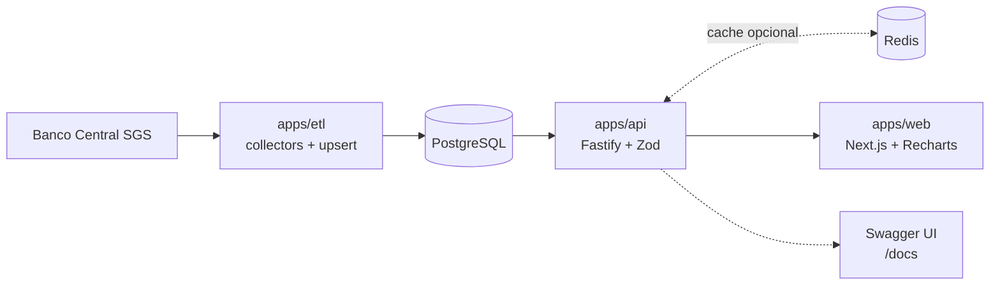
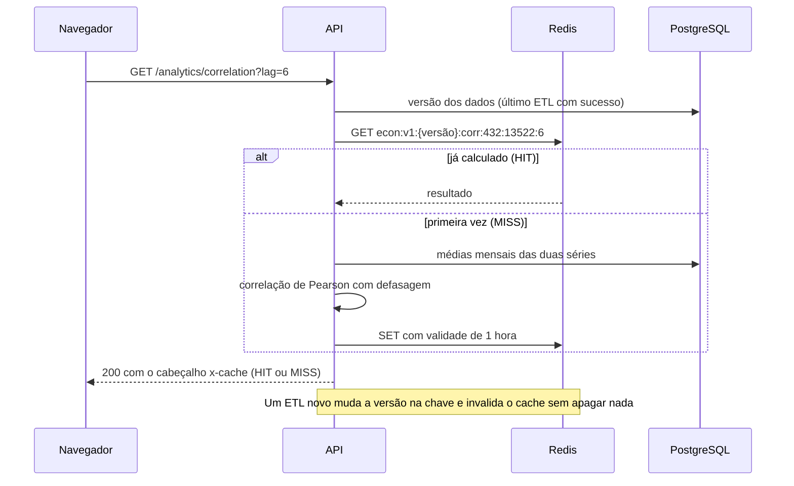
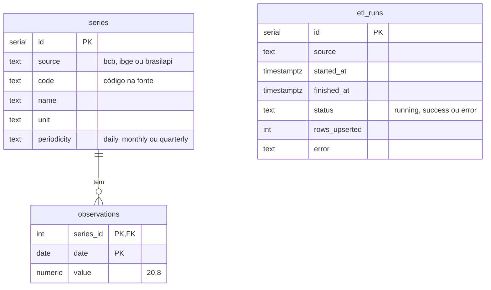

# brasil-econ-dashboard

[](https://github.com/MatheusAnsel/brasil-econ-dashboard/actions/workflows/ci.yml)
[](#testes-e-ci)
[](#como-rodar-localmente)
[](#api)

Dashboard de indicadores econômicos do Brasil. Um job de ETL coleta séries históricas do Banco Central, grava no PostgreSQL e uma API REST em Node/TypeScript as serve para um front em Next.js, que mostra a relação entre Selic, inflação, juro real e câmbio.

## Sobre

O projeto cobre o ciclo completo de um produto de dados: coleta periódica de uma fonte pública, modelagem e persistência, API tipada com validação, análise estatística e visualização. A análise central é a correlação com defasagem (lag) entre a Selic e a inflação, além do cálculo do juro real.

## O que o dashboard mostra

1. Selic meta vs. IPCA acumulado em 12 meses, em eixo duplo
2. Juro real ao longo do tempo
3. Correlação de Pearson entre a Selic e o IPCA 12m com defasagem de 0 a 24 meses
4. Dólar (PTAX venda) vs. Selic
5. Rodapé com a última execução do ETL, lida da tabela `etl_runs`

## Arquitetura



```
apps/
  api/        Fastify + Zod. Rotas em src/routes, cache em src/cache.ts, estatística pura em src/analytics.ts
  etl/        Collectors por fonte (src/collectors) e o ETL testável (src/etl.ts); run.ts só liga ao processo
  web/        Next.js (App Router) com gráficos em Recharts
packages/
  db/         Schema Drizzle, cliente e migrações SQL (drizzle/)
test/         Infra dos testes de integração (banco de testes, helpers)
```

### Fluxo de uma requisição com cache



## Decisões técnicas

- **ETL idempotente.** `observations` tem chave primária em `(series_id, date)` e toda escrita é upsert. O job pode rodar quantas vezes for preciso sem duplicar dados.
- **Carga incremental.** Depois da primeira carga, cada execução reprocessa só os últimos 60 dias de cada série, o que cobre revisões (como as do IPCA).
- **Limite do SGS.** Séries diárias aceitam janelas de cerca de 10 anos por consulta. O collector divide o período em janelas de 9 anos e tenta de novo com backoff exponencial em caso de falha.
- **Observabilidade do pipeline.** Cada execução grava início, fim, status, linhas processadas e erros em `etl_runs`. Uma série que falha não interrompe as outras, e a execução termina com status `error` e código de saída 1.
- **Juro real.** Calculado pela equação de Fisher, `((1 + selic) / (1 + ipca12m) - 1) * 100`, e não pela subtração simples. É um juro real ex-post.
- **Correlação com defasagem.** Os valores são agregados por média mensal e pareados como `a[t]` com `b[t + lag]`. Lag positivo responde à pergunta: a Selic de hoje se relaciona com a inflação de daqui a N meses?
- **Estatística separada da I/O.** As funções de `analytics.ts` são puras e testadas sem banco.
- **Cache que se invalida sozinho.** As rotas pesadas (agregações e análises) ficam em Redis por até 1 hora. A chave inclui a hora do último ETL com sucesso, então uma carga nova troca a versão e as respostas antigas deixam de ser usadas, sem precisar apagar chaves nem coordenar nada entre o ETL e a API.
- **O cache é opcional e nunca derruba a API.** Sem `REDIS_URL` ele fica desligado. Com o Redis fora do ar, qualquer falha vira "miss" e a resposta sai do banco (o `/ready` mostra `cache: down`). Cada resposta informa `x-cache: HIT`, `MISS` ou `BYPASS`.
- **ETL testável.** A lógica fica em `etl.ts` com o coletor injetável, então os testes rodam o pipeline inteiro contra um PostgreSQL real sem acessar a internet.
- **Documentação gerada do código.** Os schemas Zod que validam as requisições também geram o OpenAPI, então a documentação dos parâmetros não diverge do que a API aceita.
- **API pública, com defesa em camadas.** Os dados são públicos, então não há login. Em troca: cabeçalhos de segurança (helmet), limite de 120 requisições por minuto por IP (429), CORS fechado por padrão em produção e validação de toda entrada.

## Fontes e séries

Todas as séries vêm do SGS do Banco Central.

| Série | Código | Periodicidade |
| --- | --- | --- |
| Meta Selic | 432 | Diária |
| Selic diária | 11 | Diária |
| IPCA mensal | 433 | Mensal |
| IPCA acumulado em 12 meses | 13522 | Mensal |
| Dólar (PTAX venda) | 1 | Diária |

Padrão de consulta: `https://api.bcb.gov.br/dados/serie/bcdata.sgs.{codigo}/dados?formato=json&dataInicial=dd/MM/aaaa&dataFinal=dd/MM/aaaa`

## Modelo de dados

- `series`: id, source, code, name, unit, periodicity. Única em `(source, code)`.
- `observations`: series_id, date, value. Chave primária em `(series_id, date)`.
- `etl_runs`: source, started_at, finished_at, status, rows_upserted, error.



`etl_runs` não se liga às outras tabelas: é o registro de execuções, e o horário do último sucesso também define a versão do cache.

## API

Documentação interativa em `/docs` (Swagger UI) e o contrato em JSON em `/docs/json`. Ela é gerada a partir das rotas e dos schemas Zod, e um teste valida que é um documento OpenAPI 3.1 correto.

| Método | Rota | Descrição |
| --- | --- | --- |
| GET | `/health` | Liveness: o processo está no ar |
| GET | `/ready` | Readiness: o banco responde. Informa o estado do cache (`disabled`, `up` ou `down`) |
| GET | `/series` | Lista as séries disponíveis |
| GET | `/series/:id/observations?from=&to=&agg=` | Observações com filtro de período. `agg` aceita `none`, `month` e `year` (média no período, em cache) |
| GET | `/analytics/correlation?a=432&b=13522&lag=6` | Correlação de Pearson entre duas séries (códigos do BCB) com defasagem em meses (em cache) |
| GET | `/analytics/real-rate?from=&to=` | Juro real mensal (Selic meta e IPCA 12m) (em cache) |
| GET | `/etl/status` | Última execução do ETL |

Os parâmetros são validados com Zod e respondem 400 com os detalhes do erro. Série inexistente ou sem dados responde 404, e o excesso de requisições responde 429.

## Como rodar localmente

### Com Docker (um comando)

Sobe PostgreSQL, Redis, migrações, API, ETL e front, sem instalar Node:

```bash
git clone https://github.com/MatheusAnsel/brasil-econ-dashboard.git
cd brasil-econ-dashboard
npm run docker:up        # = docker compose --profile app up --build
```

| Serviço | Endereço |
| --- | --- |
| Front | http://localhost:3000 |
| API | http://localhost:3333 |
| Documentação | http://localhost:3333/docs |

Na primeira subida o ETL carrega o histórico do BCB desde 2005 (o tempo depende da resposta da API do BCB); o front mostra os gráficos quando a carga terminar. Para encerrar, `npm run docker:down`. O endereço da API que o navegador usa é definido no build do front (`NEXT_PUBLIC_API_URL` em `docker-compose.yml`).

### Sem Docker para a aplicação

Requisitos: Node.js 20 ou superior e Docker (só para o PostgreSQL e o Redis).

```bash
git clone https://github.com/MatheusAnsel/brasil-econ-dashboard.git
cd brasil-econ-dashboard
cp .env.example .env
npm install

npm run db:up        # PostgreSQL e Redis locais via docker compose
npm run db:migrate   # aplica as migrações
npm run etl          # carga histórica do BCB (reexecutar faz upsert incremental)
npm run api          # API em http://localhost:3333 (cache ativo se REDIS_URL estiver no .env)
npm run web          # front em http://localhost:3000
```

Exemplos:

```bash
curl http://localhost:3333/series
curl "http://localhost:3333/series/1/observations?from=2020-01-01&agg=month"
curl -i "http://localhost:3333/analytics/correlation?a=432&b=13522&lag=6"   # veja o x-cache
curl http://localhost:3333/etl/status
```

Para alterar o schema, edite `packages/db/src/schema.ts` e rode `npm run db:generate`.

## Testes e CI

```bash
npm run typecheck
npm test                 # precisa de um PostgreSQL de testes (veja abaixo)
npm run test:coverage
npm run build
```

79 testes (Vitest). Os de integração rodam contra um **PostgreSQL real** e, quando há `TEST_REDIS_URL`, contra um **Redis real**, em vez de mocks. Isso valida o SQL de verdade, e foi assim que apareceu um bug que a lógica pura não mostrava: `agg=month` e `agg=year` respondiam 500 porque o PostgreSQL rejeitava a unidade de tempo enviada como parâmetro.

O que está coberto:

- **ETL** (contra o banco): carga inicial, idempotência (rodar duas vezes não duplica), atualização de valores revisados pela fonte, falha parcial (uma série cai, as outras são gravadas e a execução fica com status `error`), janela de reprocessamento de 60 dias e gravação em lotes.
- **Collector do BCB**: URL do SGS, janelas de 9 anos e retentativas com espera crescente (com `fetch` simulado).
- **Rotas da API**: séries, observações com filtros e agregações, correlação com defasagem, juro real, status do ETL, validações (400), inexistentes (404) e `/ready`.
- **Cache**: HIT e MISS, chaves por parâmetro, respostas de erro não cacheadas, invalidação quando um ETL termina com sucesso, e o comportamento com o Redis fora do ar.
- **Proteções**: cabeçalhos do helmet, limite de requisições e CORS.
- **Documentação**: o spec OpenAPI é válido e os parâmetros documentados saem dos mesmos schemas que validam.
- **Estatística pura**: Pearson, pareamento com lag, soma de meses entre anos e juro real.

| Cobertura (out/2026) | Medido | Mínimo exigido no CI |
| --- | --- | --- |
| Linhas e instruções | 100% | 95% |
| Branches | 99% | 90% |
| Funções | 100% | 95% |

Se a cobertura cair abaixo do mínimo, o CI falha. Para rodar os testes localmente, crie um banco que termine em `_test` (a suíte apaga os dados dele e se recusa a rodar em outro) e aponte `TEST_DATABASE_URL`; opcionalmente defina `TEST_REDIS_URL`.

O workflow em `.github/workflows/ci.yml` roda a cada push e pull request, em dois jobs:

1. **Typecheck, testes e build**: PostgreSQL e Redis como serviços, auditoria das dependências de produção, typecheck, testes com cobertura e build do front.
2. **Docker**: sobe a stack completa (banco, Redis, migrações, API e front) e faz um teste de fumaça: `/ready` com cache ativo, `/docs`, a página do front e uma agregação que precisa responder `MISS` e depois `HIT`. Em seguida roda o ETL em janela curta como melhor esforço, já que depende da API pública do BCB.

## Deploy

- **Banco:** projeto no Supabase. Use a connection string em `DATABASE_URL` com `DATABASE_SSL=true` e rode `npm run db:migrate` uma vez.
- **API e ETL:** o `render.yaml` descreve um web service para a API e um cron job diário para o ETL. Configure `DATABASE_URL` e `CORS_ORIGIN` no painel. O blueprint já define `TRUST_PROXY=true` (necessário atrás do proxy do Render para o limite de requisições enxergar o IP real de cada visitante). `REDIS_URL` é opcional: aponte para um Redis (por exemplo, o Key Value do Render) para ativar o cache.
- **Front:** Vercel com root directory `apps/web` e a variável `NEXT_PUBLIC_API_URL` apontando para a API.

## Limitações conhecidas

- Os gráficos usam médias mensais. Para a Selic meta isso suaviza o dia exato das mudanças.
- A correlação entre séries de tendência, como Selic e inflação, não implica causalidade e pode ser influenciada por autocorrelação.
- O cache usa validade fixa de 1 hora e é invalidado pelo ETL. Dados corrigidos direto no banco, fora do ETL, só aparecem quando a chave expira.
- O limite de requisições é aplicado por processo. Com várias instâncias da API, cada uma conta separado.

## Roadmap

- [ ] Marcações das reuniões do Copom nos gráficos
- [ ] IBGE (SIDRA): IPCA por grupo e PIB
- [ ] Brasil API como fonte complementar de câmbio

## Autor

Matheus Ansel, desenvolvedor full-stack. Portfólio: [matheusansel-dev.vercel.app](https://matheusansel-dev.vercel.app)
