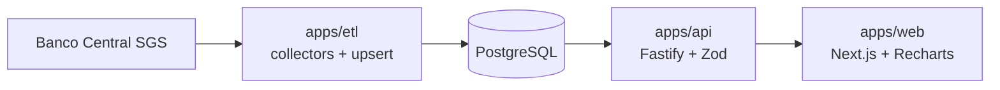

# brasil-econ-dashboard

[](https://github.com/MatheusAnsel/brasil-econ-dashboard/actions/workflows/ci.yml)

Dashboard de indicadores econômicos do Brasil. Um job de ETL coleta séries históricas do Banco Central, grava no PostgreSQL e uma API REST em Node/TypeScript as serve para um front em Next.js, que mostra a relação entre Selic, inflação, juro real e câmbio.

## Sobre

O projeto cobre o ciclo completo de um produto de dados: coleta periódica de uma fonte pública, modelagem e persistência, API tipada com validação, análise estatística e visualização. A análise central é a correlação com defasagem (lag) entre a Selic e a inflação, além do cálculo do juro real.

## O que o dashboard mostra

1. Selic meta vs. IPCA acumulado em 12 meses, em eixo duplo
2. Juro real ao longo do tempo
3. Correlação de Pearson entre a Selic e o IPCA 12m com defasagem de 0 a 24 meses
4. Dólar (PTAX venda) vs. Selic
5. Rodapé com a última execução do ETL, lida da tabela `etl_runs`

## Arquitetura



```
apps/
  api/        Fastify + Zod. Rotas em src/routes, estatística pura em src/analytics.ts
  etl/        Collectors por fonte (src/collectors) e job principal (src/run.ts)
  web/        Next.js (App Router) com gráficos em Recharts
packages/
  db/         Schema Drizzle, cliente e migrações SQL (drizzle/)
```

## Decisões técnicas

- **ETL idempotente.** `observations` tem chave primária em `(series_id, date)` e toda escrita é upsert. O job pode rodar quantas vezes for preciso sem duplicar dados.
- **Carga incremental.** Depois da primeira carga, cada execução reprocessa só os últimos 60 dias de cada série, o que cobre revisões (como as do IPCA).
- **Limite do SGS.** Séries diárias aceitam janelas de cerca de 10 anos por consulta. O collector divide o período em janelas de 9 anos e tenta de novo com backoff exponencial em caso de falha.
- **Observabilidade do pipeline.** Cada execução grava início, fim, status, linhas processadas e erros em `etl_runs`. Uma série que falha não interrompe as outras, e a execução termina com status `error` e código de saída 1.
- **Juro real.** Calculado pela equação de Fisher, `((1 + selic) / (1 + ipca12m) - 1) * 100`, e não pela subtração simples. É um juro real ex-post.
- **Correlação com defasagem.** Os valores são agregados por média mensal e pareados como `a[t]` com `b[t + lag]`. Lag positivo responde à pergunta: a Selic de hoje se relaciona com a inflação de daqui a N meses?
- **Estatística separada da I/O.** As funções de `analytics.ts` são puras e testadas sem banco.

## Fontes e séries

Todas as séries vêm do SGS do Banco Central.

| Série | Código | Periodicidade |
| --- | --- | --- |
| Meta Selic | 432 | Diária |
| Selic diária | 11 | Diária |
| IPCA mensal | 433 | Mensal |
| IPCA acumulado em 12 meses | 13522 | Mensal |
| Dólar (PTAX venda) | 1 | Diária |

Padrão de consulta: `https://api.bcb.gov.br/dados/serie/bcdata.sgs.{codigo}/dados?formato=json&dataInicial=dd/MM/aaaa&dataFinal=dd/MM/aaaa`

## Modelo de dados

- `series`: id, source, code, name, unit, periodicity. Única em `(source, code)`.
- `observations`: series_id, date, value. Chave primária em `(series_id, date)`.
- `etl_runs`: source, started_at, finished_at, status, rows_upserted, error.

## API

| Método | Rota | Descrição |
| --- | --- | --- |
| GET | `/health` | Verificação de saúde |
| GET | `/series` | Lista as séries disponíveis |
| GET | `/series/:id/observations?from=&to=&agg=` | Observações com filtro de período. `agg` aceita `none`, `month` e `year` (média no período) |
| GET | `/analytics/correlation?a=432&b=13522&lag=6` | Correlação de Pearson entre duas séries (códigos do BCB) com defasagem em meses |
| GET | `/analytics/real-rate?from=&to=` | Juro real mensal (Selic meta e IPCA 12m) |
| GET | `/etl/status` | Última execução do ETL |

Os parâmetros são validados com Zod e respondem 400 em caso de erro.

## Como rodar localmente

Requisitos: Node.js 20 ou superior e Docker (para o PostgreSQL local).

```bash
git clone https://github.com/MatheusAnsel/brasil-econ-dashboard.git
cd brasil-econ-dashboard
cp .env.example .env
npm install

npm run db:up        # PostgreSQL local via docker compose
npm run db:migrate   # aplica as migrações
npm run etl          # carga histórica do BCB (reexecutar faz upsert incremental)
npm run api          # API em http://localhost:3333
npm run web          # front em http://localhost:3000
```

Exemplos:

```bash
curl http://localhost:3333/series
curl "http://localhost:3333/series/1/observations?from=2020-01-01&agg=month"
curl "http://localhost:3333/analytics/correlation?a=432&b=13522&lag=6"
curl http://localhost:3333/etl/status
```

Para alterar o schema, edite `packages/db/src/schema.ts` e rode `npm run db:generate`.

## Testes e CI

```bash
npm run typecheck
npm test
npm run build
```

Os testes (Vitest) cobrem a divisão de janelas de datas e o parse do SGS no ETL, e as funções de estatística da API: Pearson, pareamento com lag, soma de meses entre anos e juro real. O workflow em `.github/workflows/ci.yml` roda typecheck, testes e build do front a cada push e pull request.

## Deploy

- **Banco:** projeto no Supabase. Use a connection string em `DATABASE_URL` com `DATABASE_SSL=true` e rode `npm run db:migrate` uma vez.
- **API e ETL:** o `render.yaml` descreve um web service para a API e um cron job diário para o ETL. Configure `DATABASE_URL` e `CORS_ORIGIN` no painel.
- **Front:** Vercel com root directory `apps/web` e a variável `NEXT_PUBLIC_API_URL` apontando para a API.

## Limitações conhecidas

- Os gráficos usam médias mensais. Para a Selic meta isso suaviza o dia exato das mudanças.
- A correlação entre séries de tendência, como Selic e inflação, não implica causalidade e pode ser influenciada por autocorrelação.
- O ETL e as rotas com banco ainda não têm testes de integração. Hoje os testes cobrem a lógica pura.

## Roadmap

- [ ] Marcações das reuniões do Copom nos gráficos
- [ ] IBGE (SIDRA): IPCA por grupo e PIB
- [ ] Brasil API como fonte complementar de câmbio
- [ ] Testes de integração com PostgreSQL no CI

## Autor

Matheus Ansel, desenvolvedor full-stack. Portfólio: [matheusansel-dev.vercel.app](https://matheusansel-dev.vercel.app)
